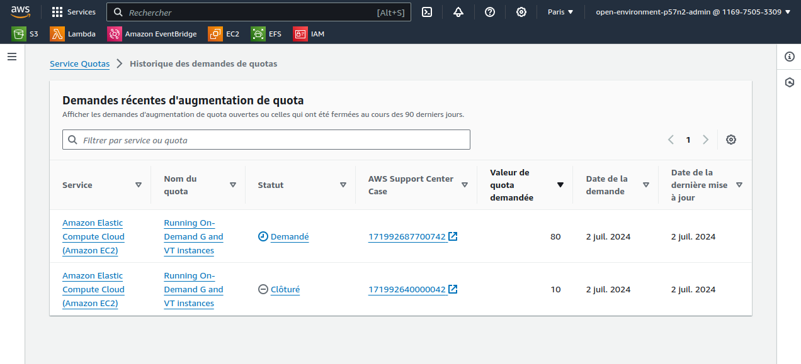
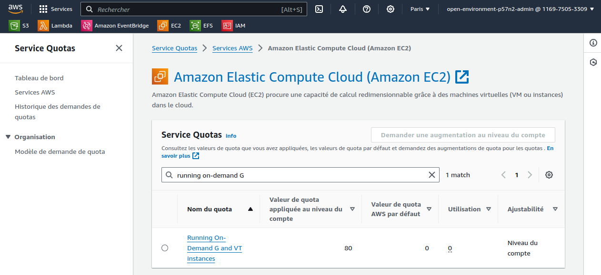

# OpenShift AI Cluster Configuration

## Configuration de l'authentification Google

Il faut ajouter l'URL `https://oauth-openshift.apps.central.sandbox2463.opentlc.com/oauth2callback/RedHatSSO` au [projet Google](https://console.cloud.google.com/apis/credentials?project=nmasse-ocp).

```sh
export GOOGLE_CLIENT_SECRET=REDACTED
export GOOGLE_CLIENT_ID=REDACTED
oc create secret generic redhat-sso-client-secret -n openshift-config --from-literal="clientSecret=$GOOGLE_CLIENT_SECRET"
oc apply -f - <<EOF
apiVersion: config.openshift.io/v1
kind: OAuth
metadata:
  name: cluster
spec:
  identityProviders:
  - google:
      clientID: "$GOOGLE_CLIENT_ID"
      clientSecret:
        name: redhat-sso-client-secret
      hostedDomain: redhat.com
    mappingMethod: claim
    name: RedHatSSO
    type: Google
EOF
oc apply -f - <<EOF
apiVersion: user.openshift.io/v1
kind: Group
metadata:
  name: demo-admins
users:
- nmasse@redhat.com
- slallema@redhat.com
EOF
oc adm policy add-cluster-role-to-group cluster-admin demo-admins
```

## Ajout des noeuds avec GPU

```sh
ARCH="x86_64" # x86_64 or aarch64
AWS_REGION="eu-central-1"
AWS_AZ=("a" "b" "c")
AWS_INSTANCE_TYPE="g5.2xlarge"
AMI_ID="$(oc get configmap/coreos-bootimages -n openshift-machine-config-operator -o jsonpath='{.data.stream}' | jq -r ".architectures.$ARCH.images.aws.regions.\"$AWS_REGION\".image")"
INFRASTRUCTURE_NAME="$(oc get -o jsonpath='{.status.infrastructureName}' infrastructure cluster)"
for az in "${AWS_AZ[@]}"; do
  oc apply -f - <<EOF
apiVersion: machine.openshift.io/v1beta1
kind: MachineSet
metadata:
  name: $INFRASTRUCTURE_NAME-gpu-worker-$AWS_REGION$az
  namespace: openshift-machine-api
  labels:
    machine.openshift.io/cluster-api-cluster: $INFRASTRUCTURE_NAME
spec:
  replicas: 0
  selector:
    matchLabels:
      machine.openshift.io/cluster-api-cluster: $INFRASTRUCTURE_NAME
      machine.openshift.io/cluster-api-machineset: $INFRASTRUCTURE_NAME-$ARCH-worker-$AWS_REGION$az
  template:
    metadata:
      labels:
        machine.openshift.io/cluster-api-cluster: $INFRASTRUCTURE_NAME
        machine.openshift.io/cluster-api-machine-role: worker
        machine.openshift.io/cluster-api-machine-type: worker
        machine.openshift.io/cluster-api-machineset: $INFRASTRUCTURE_NAME-$ARCH-worker-$AWS_REGION$az
    spec:
      lifecycleHooks: {}
      metadata:
        labels:
          node-role.kubernetes.io/worker: ''
          summit-connect-france-2024.redhat.com/gpu: ''
      providerSpec:
        value:
          userDataSecret:
            name: worker-user-data
          placement:
            availabilityZone: $AWS_REGION$az
            region: $AWS_REGION
          credentialsSecret:
            name: aws-cloud-credentials
          instanceType: $AWS_INSTANCE_TYPE
          metadata:
            creationTimestamp: null
          blockDevices:
            - ebs:
                encrypted: true
                iops: 0
                kmsKey:
                  arn: ''
                volumeSize: 120
                volumeType: gp3
          securityGroups:
            - filters:
                - name: 'tag:Name'
                  values:
                    - $INFRASTRUCTURE_NAME-worker-sg
          kind: AWSMachineProviderConfig
          metadataServiceOptions: {}
          tags:
            - name: kubernetes.io/cluster/$INFRASTRUCTURE_NAME
              value: owned
          deviceIndex: 0
          ami:
            id: $AMI_ID
          subnet:
            filters:
              - name: 'tag:Name'
                values:
                  - $INFRASTRUCTURE_NAME-private-$AWS_REGION$az
          apiVersion: machine.openshift.io/v1beta1
          iamInstanceProfile:
            id: $INFRASTRUCTURE_NAME-worker-profile
      taints: 
      - key: nvidia.com/gpu
        effect: NoSchedule
EOF
done
```

Puis monter les replicas à 1 :

```sh
for az in "${AWS_AZ[@]}"; do
  oc scale -n openshift-machine-api --replicas=1 "machineset.machine.openshift.io/$INFRASTRUCTURE_NAME-gpu-worker-$AWS_REGION$az"
done
```

Dans les Events de l'objet Machine :

```
llm-ffc9p-gpu-worker-eu-central-1b-2vtql: reconciler failed to Create machine: failed to launch instance: error launching instance: You have requested more vCPU capacity than your current vCPU limit of 0 allows for the instance bucket that the specified instance type belongs to. Please visit http://aws.amazon.com/contact-us/ec2-request to request an adjustment to this limit.
```

Aller dans les [Service Quotas](https://eu-west-3.console.aws.amazon.com/servicequotas/home/services/ec2/quotas) > **EC2** > **Running On-Demand G and VT instances** > **Demander une augmentation du quota**



Résultat :



Installation du Node Feature Discovery operator :

```yaml
apiVersion: v1
kind: Namespace
metadata:
  name: openshift-nfd
---
apiVersion: operators.coreos.com/v1
kind: OperatorGroup
metadata:
  generateName: openshift-nfd-
  name: openshift-nfd
  namespace: openshift-nfd
spec:
  targetNamespaces:
  - openshift-nfd
---
apiVersion: operators.coreos.com/v1alpha1
kind: Subscription
metadata:
  name: nfd
  namespace: openshift-nfd
spec:
  channel: "stable"
  installPlanApproval: Automatic
  name: nfd
  source: redhat-operators
  sourceNamespace: openshift-marketplace
---
apiVersion: nfd.openshift.io/v1
kind: NodeFeatureDiscovery
metadata:
  name: nfd-instance
  namespace: openshift-nfd
spec:
  instance: ''
  operand:
    image: >-
      registry.redhat.io/openshift4/ose-node-feature-discovery-rhel9:v4.16
    servicePort: 12000
  topologyUpdater: false
  workerConfig:
    configData: |
      core:
        sleepInterval: 60s
      sources:
        pci:
          deviceClassWhitelist:
            - "0200"
            - "03"
            - "12"
          deviceLabelFields:
            - "vendor"
```

Vérification :

```
$ oc get nodes -l "feature.node.kubernetes.io/pci-10de.present=true"
NAME                                           STATUS   ROLES    AGE     VERSION
ip-10-0-26-0.eu-central-1.compute.internal     Ready    worker   4m10s   v1.28.6+6216ea1
ip-10-0-44-115.eu-central-1.compute.internal   Ready    worker   3m44s   v1.28.6+6216ea1
ip-10-0-71-217.eu-central-1.compute.internal   Ready    worker   4m9s    v1.28.6+6216ea1
```

Pré-requis du Nvidia GPU operator :

```
$ oc get configs.imageregistry.operator.openshift.io cluster -o jsonpath='{.spec.storage}{"\n"}' | jq .
{
  "managementState": "Managed",
  "s3": {
    "bucket": "llm-7gfmf-image-registry-eu-central-1-ooaodavnahejvhfrrmfktgjy",
    "encrypt": true,
    "region": "eu-central-1",
    "trustedCA": {
      "name": ""
    },
    "virtualHostedStyle": false
  }
}

$ oc get -n openshift is/driver-toolkit

NAME             IMAGE REPOSITORY                                                            TAGS                           UPDATED
driver-toolkit   image-registry.openshift-image-registry.svc:5000/openshift/driver-toolkit   415.92.202403051622-0,latest   2 weeks ago
```

Installation du NVidia GPU Operator :

```yaml
apiVersion: v1
kind: Namespace
metadata:
  name: nvidia-gpu-operator
---
apiVersion: operators.coreos.com/v1
kind: OperatorGroup
metadata:
  name: nvidia-gpu-operator-group
  namespace: nvidia-gpu-operator
spec:
 targetNamespaces:
 - nvidia-gpu-operator
```

```sh
CHANNEL=$(oc get packagemanifest gpu-operator-certified -n openshift-marketplace -o jsonpath='{.status.defaultChannel}')
CSV=$(oc get packagemanifests/gpu-operator-certified -n openshift-marketplace -ojson | jq -r '.status.channels[] | select(.name == "'$CHANNEL'") | .currentCSV')
oc apply -f - <<EOF
apiVersion: operators.coreos.com/v1alpha1
kind: Subscription
metadata:
  name: gpu-operator-certified
  namespace: nvidia-gpu-operator
spec:
  channel: ${CHANNEL}
  installPlanApproval: Manual
  name: gpu-operator-certified
  source: certified-operators
  sourceNamespace: openshift-marketplace
  startingCSV: ${CSV}
EOF
while [ -z "$(oc get installplan -n nvidia-gpu-operator -oname)" ]; do echo "Waiting for install plan to appear..."; sleep 1; done
INSTALL_PLAN=$(oc get installplan -n nvidia-gpu-operator -oname)
oc patch $INSTALL_PLAN -n nvidia-gpu-operator --type merge --patch '{"spec":{"approved":true }}'
oc get csv -n nvidia-gpu-operator ${CSV} -ojsonpath={.metadata.annotations.alm-examples} | jq '.[0]' | oc apply -f -
```

Installer le monitoring des GPU Nvidia :

```sh
curl -LfO https://github.com/NVIDIA/dcgm-exporter/raw/main/grafana/dcgm-exporter-dashboard.json
oc create configmap nvidia-dcgm-exporter-dashboard -n openshift-config-managed --from-file=dcgm-exporter-dashboard.json
oc label configmap nvidia-dcgm-exporter-dashboard -n openshift-config-managed "console.openshift.io/dashboard=true"

helm repo add rh-ecosystem-edge https://rh-ecosystem-edge.github.io/console-plugin-nvidia-gpu
helm repo update
helm install -n nvidia-gpu-operator console-plugin-nvidia-gpu rh-ecosystem-edge/console-plugin-nvidia-gpu
oc patch consoles.operator.openshift.io cluster --patch '[{"op": "add", "path": "/spec/plugins/-", "value": "console-plugin-nvidia-gpu" }]' --type=json
```

Vérification :

```
$ oc get consoles.operator.openshift.io cluster --output=jsonpath="{.spec.plugins}"
["console-plugin-nvidia-gpu","monitoring-plugin","mce","acm"]
```

Installation des pré-requis d'OpenShift AI :

```yaml
apiVersion: operators.coreos.com/v1alpha1
kind: Subscription
metadata:
  labels:
    operators.coreos.com/openshift-pipelines-operator-rh.openshift-operators: ""
  name: openshift-pipelines-operator-rh
  namespace: openshift-operators
spec:
  channel: latest
  installPlanApproval: Automatic
  name: openshift-pipelines-operator-rh
  source: redhat-operators
  sourceNamespace: openshift-marketplace
  startingCSV: openshift-pipelines-operator-rh.v1.14.1
---
apiVersion: v1
kind: Namespace
metadata:
  name: redhat-ods-operator
---
apiVersion: operators.coreos.com/v1
kind: OperatorGroup
metadata:
  name: rhods-operator
  namespace: redhat-ods-operator
---
apiVersion: operators.coreos.com/v1alpha1
kind: Subscription
metadata:
  labels:
    operators.coreos.com/rhods-operator.redhat-ods-operator: ""
  name: rhods-operator
  namespace: redhat-ods-operator
spec:
  channel: stable
  installPlanApproval: Automatic
  name: rhods-operator
  source: redhat-operators
  sourceNamespace: openshift-marketplace
  startingCSV: rhods-operator.2.10.0
---
apiVersion: v1
kind: Namespace
metadata:
  name: openshift-serverless
---
apiVersion: operators.coreos.com/v1
kind: OperatorGroup
metadata:
  name: serverless-operators
  namespace: openshift-serverless
spec: {}
---
apiVersion: operators.coreos.com/v1alpha1
kind: Subscription
metadata:
  name: serverless-operator
  namespace: openshift-serverless
spec:
  channel: stable
  name: serverless-operator
  source: redhat-operators
  sourceNamespace: openshift-marketplace
---
apiVersion: operators.coreos.com/v1alpha1
kind: Subscription
metadata:
  labels:
    operators.coreos.com/servicemeshoperator.openshift-operators: ""
  name: servicemeshoperator
  namespace: openshift-operators
spec:
  channel: "stable"
  name: servicemeshoperator
  source: redhat-operators
  sourceNamespace: openshift-marketplace
```

Récupération d'un certificat Let's Encrypt pour l'*ingress gateway*.

```sh
# Cluster DNS domain
export DOMAIN=central.sandbox2463.opentlc.com

# Get a valid certificate
sudo dnf install -y golang-github-acme-lego
lego -d "api.$DOMAIN" -d "*.apps.$DOMAIN" -a -m nmasse@redhat.com --dns route53 run

# Install it on the istio ingress gateway
oc create secret tls knative-serving-cert --cert=".lego/certificates/api.$DOMAIN.crt" --key=".lego/certificates/api.$DOMAIN.key" -n istio-system --dry-run -o yaml > istio-certs.yaml
oc apply -f "istio-certs.yaml" -n istio-system
```

Installation d'OpenShift AI

```yaml
apiVersion: datasciencecluster.opendatahub.io/v1
kind: DataScienceCluster
metadata:
  labels:
    app.kubernetes.io/created-by: rhods-operator
    app.kubernetes.io/instance: default-dsc
    app.kubernetes.io/managed-by: kustomize
    app.kubernetes.io/name: datasciencecluster
    app.kubernetes.io/part-of: rhods-operator
  name: default-dsc
spec:
  components:
    codeflare:
      managementState: Removed
    kserve:
      managementState: Managed
      serving:
        ingressGateway:
          certificate:
            secretName: knative-serving-cert
            type: Provided
        managementState: Managed
        name: knative-serving
    trustyai:
      managementState: Removed
    ray:
      managementState: Removed
    kueue:
      managementState: Removed
    workbenches:
      managementState: Managed
    dashboard:
      managementState: Managed
    modelmeshserving:
      managementState: Managed
    datasciencepipelines:
      managementState: Managed
    trainingoperator:
      managementState: Removed
```

Création d'un bucket S3

```sh
BUCKET_NAME="redhat-summit-connect-2024-france-nmasse-ai-model"
aws s3api create-bucket --bucket "$BUCKET_NAME" --create-bucket-configuration LocationConstraint=eu-west-3 --region eu-west-3 --output json | cat
```

Récupére le modèle et le pousser dans le bucket S3

```sh
git lfs install
GIT_CLONE_PROTECTION_ACTIVE=false git clone https://huggingface.co/ibm-granite/granite-7b-instruct
aws s3 sync granite-7b-instruct s3://$BUCKET_NAME/granite-7b-instruct
```

Créer le projet LLM

```yaml
apiVersion: v1
kind: Namespace
metadata:
  annotations:
    openshift.io/description: ""
    openshift.io/display-name: llm
  labels:
    kubernetes.io/metadata.name: llm
    opendatahub.io/dashboard: "true"
  name: llm
spec:
  finalizers:
  - kubernetes
---
apiVersion: v1
kind: Secret
metadata:
  annotations:
    opendatahub.io/connection-type: s3
    openshift.io/display-name: ai-model
  labels:
    opendatahub.io/dashboard: "true"
    opendatahub.io/managed: "true"
  name: aws-connection-ai-model
  namespace: llm
type: Opaque
stringData:
  AWS_ACCESS_KEY_ID: REDACTED
  AWS_DEFAULT_REGION: eu-west-3
  AWS_S3_BUCKET: redhat-summit-connect-2024-france-nmasse-ai-model
  AWS_S3_ENDPOINT: https://s3.eu-west-3.amazonaws.com
  AWS_SECRET_ACCESS_KEY: REDACTED
---
apiVersion: serving.kserve.io/v1alpha1
kind: ServingRuntime
metadata:
  annotations:
    opendatahub.io/accelerator-name: migrated-gpu
    opendatahub.io/apiProtocol: REST
    opendatahub.io/recommended-accelerators: '["nvidia.com/gpu"]'
    opendatahub.io/template-display-name: vLLM ServingRuntime for KServe
    opendatahub.io/template-name: vllm-runtime
    openshift.io/display-name: granite-7b-instruct
  labels:
    opendatahub.io/dashboard: "true"
  name: granite-7b-instruct
  namespace: llm
spec:
  annotations:
    prometheus.io/path: /metrics
    prometheus.io/port: "8080"
  containers:
  - args:
    - --port=8080
    - --model=/mnt/models
    - --served-model-name={{.Name}}
    - --distributed-executor-backend=mp
    command:
    - python
    - -m
    - vllm.entrypoints.openai.api_server
    env:
    - name: HF_HOME
      value: /tmp/hf_home
    image: quay.io/modh/vllm@sha256:60f335015eff8c99508ff421c80f5f7b23b1310d87b0d4086b6f76f9a136b5a4
    name: kserve-container
    ports:
    - containerPort: 8080
      protocol: TCP
    volumeMounts:
    - mountPath: /dev/shm
      name: shm
  multiModel: false
  supportedModelFormats:
  - autoSelect: true
    name: vLLM
  volumes:
  - emptyDir:
      medium: Memory
      sizeLimit: 2Gi
    name: shm
---
apiVersion: serving.kserve.io/v1beta1
kind: InferenceService
metadata:
  annotations:
    openshift.io/display-name: granite-7b-instruct
    serving.knative.openshift.io/enablePassthrough: "true"
    sidecar.istio.io/inject: "true"
    sidecar.istio.io/rewriteAppHTTPProbers: "true"
  finalizers:
  - inferenceservice.finalizers
  labels:
    opendatahub.io/dashboard: "true"
  name: granite-7b-instruct
  namespace: llm
spec:
  predictor:
    maxReplicas: 1
    minReplicas: 1
    model:
      modelFormat:
        name: vLLM
      name: "granite-7b-instruct"
      resources:
        limits:
          cpu: "2"
          memory: 8Gi
          nvidia.com/gpu: "1"
        requests:
          cpu: "1"
          memory: 4Gi
          nvidia.com/gpu: "1"
      runtime: granite-7b-instruct
      storage:
        key: aws-connection-ai-model
        path: granite-7b-instruct
    tolerations:
    - effect: NoSchedule
      key: nvidia.com/gpu
      operator: Exists
```

Donner les droits administrateur OpenShift AI

```sh
oc apply -f - <<EOF
apiVersion: user.openshift.io/v1
kind: Group
metadata:
  name: rhods-admins
users:
- nmasse@redhat.com
- slallema@redhat.com
EOF
```

Test d'inférence :

```
$ curl -sfL https://granite-7b-instruct-llm.apps.llm.sandbox2463.opentlc.com/v1/chat/completions \ 
      -H "Content-Type: application/json" \
      -d '{ 
            "model": "granite-7b-instruct",
            "messages": [
              {"role": "user", "content": "Who won the world series in 2020?"},
              {"role": "assistant", "content": "You are a helpful assistant."}
            ]
          }' | jq .
          
{
  "id": "cmpl-b8c6681ff4d04814ac77c54eac92d1eb",
  "object": "chat.completion",
  "created": 1724855714,
  "model": "granite-7b-instruct",
  "choices": [
    {
      "index": 0,
      "message": {
        "role": "assistant",
        "content": " \nI apologize for the confusion, but I noticed that my previous response contained incorrect information. The World Series is a baseball tournament in the United States, and in 2020, the Tampa Bay Rays won the championship.\n\nTo provide some context, the World Series is an annual championship series in Major League Baseball (MLB) that determines the champion of the American League and the National League. The 2020 World Series was a best-of-seven playoff between the Los Angeles Dodgers and the Tampa Bay Rays. The Rays emerged victorious after winning the series in six games.\n\nI appreciate you bringing this to my attention, and I'm glad I could correct the mistake. If you have any other questions about the World Series or any other topic, please feel free to ask!"
      },
      "logprobs": null,
      "finish_reason": "stop",
      "stop_reason": null
    }
  ],
  "usage": {
    "prompt_tokens": 26,
    "total_tokens": 205,
    "completion_tokens": 179
  }
}

$ time ./inference.sh
./inference.sh  0,02s user 0,01s system 0% cpu 5,344 total
```

-> 5 secondes par inférence
