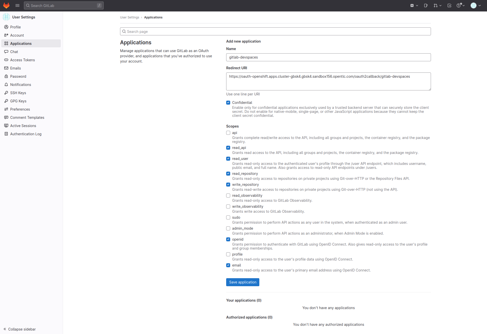
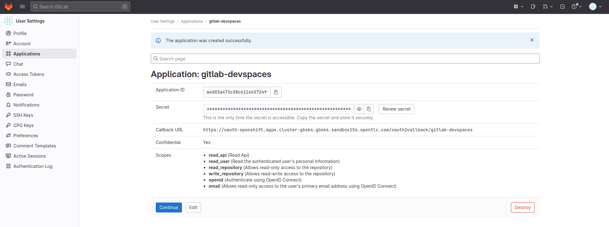
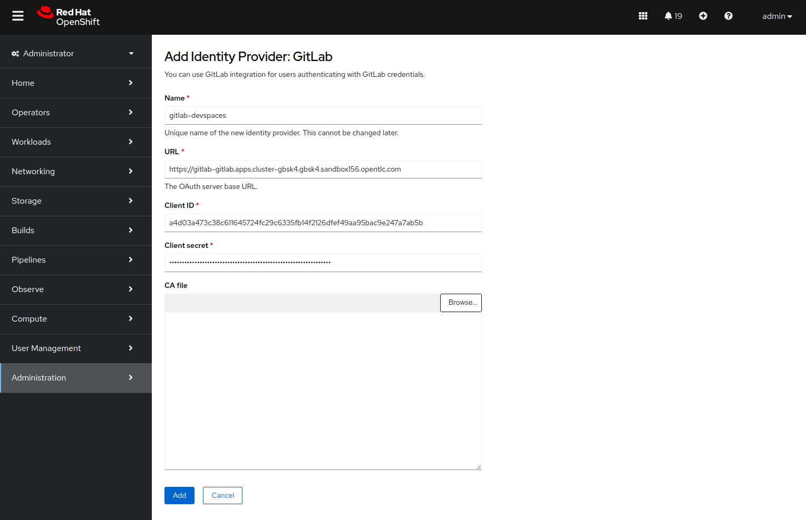

# Configuration of the managed clusters

## Désinstallation de Red Hat Advanced Cluster Management (ACM)

```sh
# Detach all managed clusters
oc delete mcl -A --all

# Uninstall ACM
oc delete multiclusterhub -n open-cluster-management --all

# Cleanup
ACM_NAMESPACE=open-cluster-management
oc delete mch --all -n $ACM_NAMESPACE
oc delete apiservice v1.admission.cluster.open-cluster-management.io v1.admission.work.open-cluster-management.io
oc delete clusterimageset --all
oc delete clusterrole multiclusterengines.multicluster.openshift.io-v1-admin multiclusterengines.multicluster.openshift.io-v1-crdview multiclusterengines.multicluster.openshift.io-v1-edit multiclusterengines.multicluster.openshift.io-v1-view open-cluster-management:addons:application-manager open-cluster-management:admin-aggregate open-cluster-management:cert-policy-controller-hub open-cluster-management:cluster-manager-admin-aggregate open-cluster-management:config-policy-controller-hub open-cluster-management:edit-aggregate open-cluster-management:iam-policy-controller-hub open-cluster-management:policy-framework-hub open-cluster-management:view-aggregate
oc delete crd klusterletaddonconfigs.agent.open-cluster-management.io placementbindings.policy.open-cluster-management.io policies.policy.open-cluster-management.io userpreferences.console.open-cluster-management.io discoveredclusters.discovery.open-cluster-management.io discoveryconfigs.discovery.open-cluster-management.io
oc delete mutatingwebhookconfiguration ocm-mutating-webhook managedclustermutators.admission.cluster.open-cluster-management.io multicluster-observability-operator
oc delete validatingwebhookconfiguration channels.apps.open.cluster.management.webhook.validator application-webhook-validator multiclusterhub-operator-validating-webhook ocm-validating-webhook multicluster-observability-operator multiclusterengines.multicluster.openshift.io

# Uninstall operator
oc delete csv -n open-cluster-management -l operators.coreos.com/advanced-cluster-management.open-cluster-management=
oc delete sub -n open-cluster-management -l operators.coreos.com/advanced-cluster-management.open-cluster-management=

# Cleanup
oc delete ns open-cluster-management
```

## Raccordement des deux clusters managés à ACM

-> Via la console.

## Configuration de Quay

Prepare pre-requisites.

```sh
git clone https://github.com/rh-trucathon/ansible.git rh-trucathon-ansible
cd rh-trucathon-ansible
ansible-galaxy collection install -r collections/requirements.yml
```

Generate an admin token in Quay.

1. Log in to the Quay Container Registry web UI.
2. Use an existing organization or create a new one.
3. In the organization, create an application.
4. In the application, select the `Generate Token` menu.
5. Select the permissions to associate to the token.
   To be able to use all the modules in the collection, select `Administer Organization`, `Administer Repositories`, `Create Repositories`, `Super User Access`, and `Administer User`.
6. Click `Generate Token`.

Create a vault and store the `quay_host` and `quay_token`.

```sh
export ANSIBLE_VAULT_IDENTITY_LIST="itix@~/local/bin/ansible-vault-password"
ansible-vault create vaults/cluster-9hbm4.yaml
```

Run the playbook.

```sh
ansible-playbook -i /dev/null -e @vaults/cluster-9hbm4.yaml quay-config.yaml
```

## Installation d'Enterprise DB

Installation de l'opérateur.

```yaml
apiVersion: operators.coreos.com/v1alpha1
kind: Subscription
metadata:
  name: cloud-native-postgresql
  namespace: openshift-operators
spec:
  channel: stable-v1.23
  name: cloud-native-postgresql
  source: certified-operators
  sourceNamespace: openshift-marketplace
```

Déploiement d'un cluster de production.

```yaml
apiVersion: v1
kind: Namespace
metadata:
  annotations:
    openshift.io/description: ""
    openshift.io/display-name: database-prod
  labels:
    kubernetes.io/metadata.name: database-prod
  name: edb-workshop-prod
spec:
  finalizers:
  - kubernetes
---
apiVersion: v1
stringData:
  password: DevZone2024#
  username: app_user
kind: Secret
metadata:
  name: app-secret-prod
  namespace: edb-workshop-prod
type: kubernetes.io/basic-auth
---
apiVersion: v1
stringData:
  password: postgres
  username: postgres
kind: Secret
metadata:
  name: postgres-user
  namespace: edb-workshop-prod
type: kubernetes.io/basic-auth
---
apiVersion: postgresql.k8s.enterprisedb.io/v1
kind: Cluster
metadata:
  name: postgresql
  namespace: database-prod
spec:
  instances: 3
  imageName: 'quay.io/enterprisedb/postgresql:16.4'
  primaryUpdateStrategy: unsupervised
  enableSuperuserAccess: true
  
  replicationSlots:
    highAvailability:
      enabled: true

  minSyncReplicas: 2
  maxSyncReplicas: 2

  managed:
    roles:
    - name: app_user
      ensure: present
      comment: Application user
      login: true
      superuser: false
      passwordSecret:
        name: app-secret-prod

  postgresql:
    parameters:
      pg_stat_statements.max: "10000"
      pg_stat_statements.track: all

      max_connections: "200"
      shared_buffers: "1GB"
      effective_cache_size: "3GB"
      maintenance_work_mem: "256MB"
      checkpoint_completion_target: "0.9"
      wal_buffers: "16MB"
      default_statistics_target: "100"
      random_page_cost: "1.1"
      effective_io_concurrency: "200"
      work_mem: "2621kB"
      huge_pages: "off"
      min_wal_size: "200MB"
      max_wal_size: "400MB"

    enableAlterSystem: true

  storage:
    size: 1Gi

  walStorage:
    resizeInUseVolumes: true
    size: 500Mi

  monitoring:
    enablePodMonitor: true

  resources:
    requests:
      memory: "4Gi"
      cpu: "2"
    limits:
      memory: "4Gi"
      cpu: "2"
```

## User Workload Monitoring

Activer la fonction **Monitoring for user-defined projects**

```sh
oc -n openshift-monitoring get configmap cluster-monitoring-config -o yaml | sed -r 's/(\senableUserWorkload:\s).*/\1true/' | oc apply -f -
```

## Misc configuration

Se connecter à **Red Hat Build of Keycloak (RHBK)** :

```sh
ADMIN_PASSWORD="$(oc extract -n keycloak-system secret/credential-keycloak --to=- --keys=ADMIN_PASSWORD 2>/dev/null)"
ADMIN_USERNAME="$(oc extract -n keycloak-system secret/credential-keycloak --to=- --keys=ADMIN_USERNAME 2>/dev/null)"
KEYCLOAK_URL="$(oc get route -n keycloak-system keycloak -o jsonpath='https://{.spec.host}/auth')"
echo -e "Authenticate to $KEYCLOAK_URL\nwith:\n  username: $ADMIN_USERNAME\n  password: $ADMIN_PASSWORD"
```

- Dans **Red Hat Build of Keycloak (RHBK)**, realm **backstage**, aller dans **Authentication** > **Flows**, **First Broker Login**, passer **Review profile** à **off**.
- Dans l'IDP **GitLab**, ajouter le endpoint **userinfo**. L'URL du endpoint s'obtient via :

```sh
oc get route -n gitlab gitlab -o jsonpath='https://{.spec.host}/oauth/userinfo'
```

- Vérifier que le **Disable userinfo** est à **false** (normalement, c'est la valeur par défaut).
- Changer le **default scope** à **openid email profile**.
- Naviguer dans **Authentication** > **Browser** > **Identity Provider Redirector** et définir **gitlab** comme IDP par défaut (alias = `idp-redirector-gitlab`)

Se connecter à ArgoCD avec :

```sh
ARGOCD_PASSWORD="$(oc extract -n openshift-gitops secret/argocd-cluster --to=- --keys=admin.password 2>/dev/null)"
ARGOCD_URL="$(oc get route -n openshift-gitops argocd-server -o jsonpath='https://{.spec.host}/')"
echo -e "Authenticate to $ARGOCD_URL\nwith:\n  username: admin\n  password: $ARGOCD_PASSWORD"
```

Dans **ArgoCD**, section **Sync policy**, désactiver l'autosync des applications **backstage** et **backstage-gitops**.

Namespace **backstage**, éditer la ConfigMap **backstage-developer-hub-app-config**, clé **app-config.yaml**. Sous la clé **catalog**, ajouter les éléments **User** et **Group** à la clé **rules**.

```yaml
catalog:
  rules:
  - allow:
    - Component
    - System
    - API
    - Resource
    - Location
    - Template
    - User
    - Group
```

Redémarrer Backstage.

```sh
oc delete pods -n backstage -l app.kubernetes.io/component=backstage
```

En **root**, créer une application dans **GitLab** avec la callback URL de l'oauth-openshift.

L'URL exacte s'obtient avec :

```sh
oc get route -n openshift-authentication oauth-openshift -o jsonpath='https://{.spec.host}/oauth2callback/gitlab-devspaces'
```

Se connecter à GitLab :

```sh
ROOT_PASSWORD="$(oc extract -n gitlab secret/gitlab-secret --to=- --keys=GITLAB_ROOT_PASSWORD 2>/dev/null)"
GITLAB_URL="$(oc get route -n gitlab gitlab -o jsonpath='https://{.spec.host}/')"
echo -e "Authenticate to $GITLAB_URL\nwith:\n  username: root\n  password: $ROOT_PASSWORD"
```

Créer une application :

- Cliquer sur l'avatar en haut à droite > **Preferences** > **Applications**.
- **Name**: `gitlab-devspaces`
- **Redirect URI**: `https://oauth-openshift.apps.cluster-gbsk4.gbsk4.sandbox156.opentlc.com/oauth2callback/gitlab-devspaces`
- **Scopes**:
	- **read_api**
	- **read_user**
	- **read_repository**
	- **write_repository**
	- **openid**
	- **email**



Noter l'**Application ID** et **Secret**.



- **Application ID**: `a4d03a473c38c611645724fc29c6335fb14f2126dfef49aa95bac9e247a7ab5b`
- **Secret**: `REDACTED`

Ajouter l’IDP gitlab dans OCP depuis la console : **Administrator** > **Cluster Settings** > **ClusterOperators** > **authentication** > **Related Objects**

Éditer l'objet de type **oauths.config.openshift.io** nommé **cluster**. Cliquer sur **Add** > **GitLab**.



L'objet **OAuth** créé : 

```yaml
apiVersion: config.openshift.io/v1
kind: OAuth
metadata:
  name: cluster
spec:
  identityProviders:
    - mappingMethod: claim
      name: rhsso
      openID:
        claims:
          email:
            - email
          name:
            - name
          preferredUsername:
            - preferred_username
        clientID: idp-4-ocp
        clientSecret:
          name: openid-client-secret-bb6zw
        extraScopes: []
        issuer: 'https://keycloak-keycloak-system.apps.cluster-gbsk4.gbsk4.sandbox156.opentlc.com/auth/realms/trusted-artifact-signer'
      type: OpenID
    - gitlab:
        clientID: a4d03a473c38c611645724fc29c6335fb14f2126dfef49aa95bac9e247a7ab5b
        clientSecret:
          name: gitlab-client-secret-f9bc2
        url: 'https://gitlab-gitlab.apps.cluster-gbsk4.gbsk4.sandbox156.opentlc.com'
      mappingMethod: claim
      name: gitlab-devspaces
      type: GitLab
---
kind: Secret
apiVersion: v1
metadata:
  name: gitlab-client-secret-f9bc2
  generateName: gitlab-client-secret-
  namespace: openshift-config
stringData:
  clientSecret: REDACTED
type: Opaque
```

Pour créer les utilisateurs dans **GitLab**, utiliser [le script de Guillaume](https://github.com/rh-trucathon/user_management/tree/main/userFiles).

```sh
git clone https://github.com/rh-trucathon/user_management rh-trucathon-user_management
cd rh-trucathon-user_management

export GITLAB_ENDPOINT="$(oc get route -n gitlab gitlab -o jsonpath='https://{.spec.host}/')"
export GITLAB_PAT="$(oc extract -n gitlab secret/root-user-personal-token --to=- --keys=token 2>/dev/null)"
export CSV_FILE_NAME="heroes_final/heroes_96 - Atlantis.csv"
export GROUP_LIST="[12,14,7]"

npm start run
```

Les valeurs des group id sont :

- gitops : 12
- Development: 14
- Rhdh : 7
- Summit-lab: 10

> [!TIP]
> Si besoin, le **Personnal Access Token** GitLab peut être trouvé dans le namespace **gitlab**, secret **root-user-personal-token**.

Se connecter à l'interface de backstage, s'authentifier sur **GitLab** avec l'utilisateur **root**.
Dans l'interface de Backstage, cliquer sur **+ Create** > **Register Existing Component**.
Renseigner l'URL et cliquer sur Import.

Format de l'URL: https://github.com/rh-trucathon/user_management/blob/main/userFiles/backstage_users/atlantis.yaml

Étendre la taille du PVC du PostgreSQL de Quay.

## DevSpaces configuration
La configuration suivante est mise en place par le playbook ansible : 
- desactivation de l'autosync argo pour DevSpaces
- maxNumberOfRunningWorkspacesPerUser=1

```sh
ansible-playbook ansible/playbook-configure-devspaces.yaml
```

## GitLab configuration
La configuration suivante est mise en place par le playbook ansible : 
- remove branch protection
- copie des templates github vers gitlab et modification du nom de cluster

```sh
ansible-playbook ansible/playbook-configure-gitlab.yaml
```

## ACS configuration
La configuration suivante est mise en place par le playbook ansible : 
- Ajout de la policy OpenCodeQuest-CVE-2016-1000031

```sh
ansible-playbook ansible/playbook-configure-acs.yaml
```

## Backstage/RHDH configuration
La configuration suivante est mise en place par le playbook ansible : 
- desactivation de l'autosync argo pour backstage et backstage-gitops
- modification du confimap app-config.yaml pour ne laisser que les templates OpenCodeQuest
- relance de RHDH après modification du CM

```sh
ansible-playbook ansible/playbook-configure-rhdh.yaml
```
